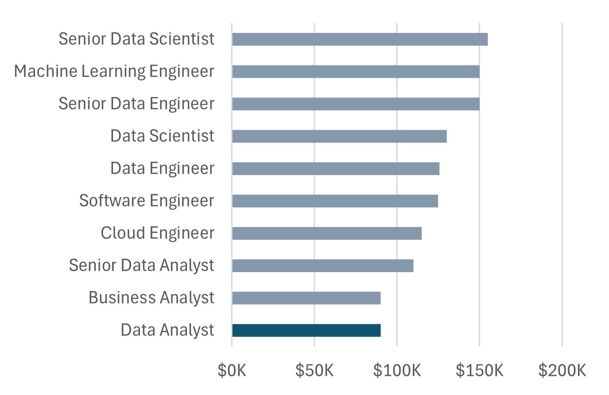

# Excel Salary Dashboard


## Introduction

I built this data jobs salary dashboard to help job seekers — including myself — investigate salaries for desired roles and ensure fair compensation.

The data comes from my Excel course, which gave me a strong foundation in analyzing data using this powerful tool. I worked with detailed information on job titles, salaries, locations, and essential skills, all of which are presented in this dashboard.

### Dashboard File
My final dashboard is in [Salary_Insights_Dashboard.xlsx](Salary_Insights_Dashboard.xlsx).

### Excel Skills I Used

Here are the Excel skills I applied throughout this project:

- **📉 Charts**
- **🧮 Formulas and Functions**
- **❎ Data Validation**

### Data Jobs Dataset

The dataset I used contains real-world data science job information from 2023, sourced via my Excel course. It includes detailed information on:

- **👨‍💼 Job titles**
- **💰 Salaries**
- **📍 Locations**
- **🛠️ Skills**

---

## How I Built the Dashboard

### 📉 Charts

#### 📊 Data Science Job Salaries — Bar Chart

 

- 🛠️ **Excel Features I Used:** I used the bar chart feature with formatted salary values and optimized the layout for clarity.
- 🎨 **My Design Choice:** I chose a horizontal bar chart to make median salary comparisons easy to scan visually.
- 📉 **How I Organized the Data:** I sorted job titles by descending salary to improve readability at a glance.
- 💡 **What I Found:** This chart made it easy to spot salary trends — Senior roles and Engineers consistently out-earn Analyst roles.

#### 🗺️ Country Median Salaries — Map Chart


- 🛠️ **Excel Features I Used:** I leveraged Excel's map chart feature to plot median salaries across the globe.
- 🎨 **My Design Choice:** I used a color-coded map to visually differentiate salary levels across regions at a glance.
- 📊 **How I Represented the Data:** I plotted the median salary for each country where data was available.
- 👁️ **Visual Enhancement:** This approach dramatically improved readability and made geographic salary trends immediately apparent.
- 💡 **What I Found:** The map quickly revealed global salary disparities and highlighted which regions pay the most and least.

---

### 🧮 Formulas and Functions I Built

#### 💰 Median Salary by Job Title
```excel
=MEDIAN(
IF(
    (jobs[job_title_short]=A2)*
    (jobs[job_country]=country)*
    (ISNUMBER(SEARCH(type,jobs[job_schedule_type])))*
    (jobs[salary_year_avg]<>0),
    jobs[salary_year_avg]
)
)
```

- 🔍 **Multi-Criteria Filtering:** I set up the formula to check job title, country, and schedule type simultaneously, while also excluding blank salary entries.
- 📊 **Array Formula:** I nested an `IF()` statement inside `MEDIAN()` to evaluate the full data array in one go.
- 🎯 **Tailored Insights:** This gives me — and other users — salary data specific to a chosen job title, region, and work type.
- **🔢 What It Does:** This formula populates the background table below, returning the median salary based on the job title, country, and type selected.

🍽️ Background Table


📉 Dashboard Implementation


---

#### ⏰ Count of Job Schedule Type
```excel
=FILTER(J2#,(NOT(ISNUMBER(SEARCH("and",J2#))+ISNUMBER(SEARCH(",",J2#))))*(J2#<>0))
```

- 🔍 **Unique List Generation:** I used the `FILTER()` function to exclude entries containing "and" or commas, and to drop any zero values — keeping only clean, distinct schedule types.
- **🔢 What It Does:** This formula populates the table below with a clean list of unique job schedule types for use in the dashboard filters.

🍽️ Background Table


📉 Dashboard Implementation


 


---

### ❎ Data Validation I Implemented

#### 🔍 Filtered List

- 🔒 **How I Enhanced Data Validation:** I applied the filtered list as a data validation rule under the `Job Title`, `Country`, and `Type` fields via the Data tab. This ensures:
    - 🎯 User input is restricted to predefined, validated options only
    - 🚫 Incorrect or inconsistent entries are blocked before they can cause issues
    - 👥 The overall usability and reliability of the dashboard is improved


  


---

## Conclusion

I created this dashboard to showcase real insights into salary trends across various data-related job roles. Using data from my Excel course, I built a tool that helps users — and myself — make more informed decisions about career paths. The dashboard lets you explore how location and job type influence compensation, all in one place.